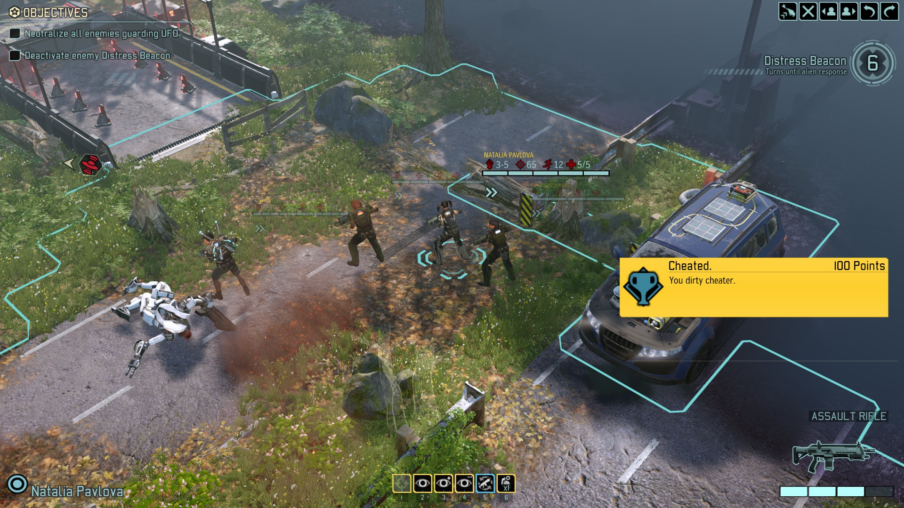
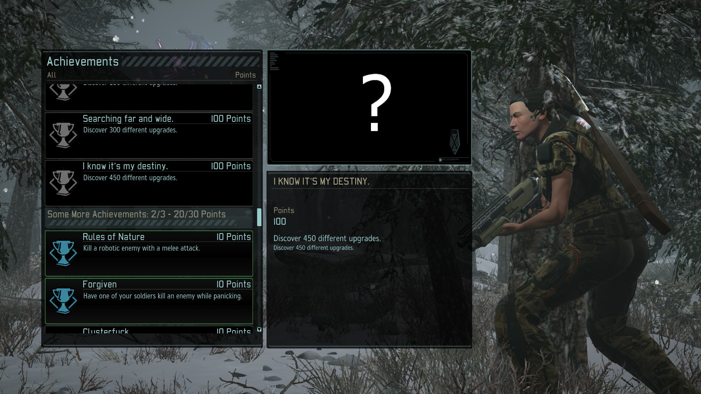

# Mod Achievement System

A system for mods to register and unlock achievements. Takes care of all the UI work for mods.

### Features

* **Optional Dependency** - It's not required for your users, everything will work normally if they don't install the Achievement System
* **Lightweight API** - Only one class to tell my mod what achievement to unlock. Everything else is handled by my mod.
* **In-game popups** - some small popups, but nothing that hinders gameplay
* **Default Icons** - Can't design icons? No worries, we prepared something.
* **Support for points, categories and completion rates** - The maximum amount of gimmicks you can get. Also, hidden achievements.

### [Documentation here](documentation/documentation.md)

### Demo Images

In game popup

List of all achievements

